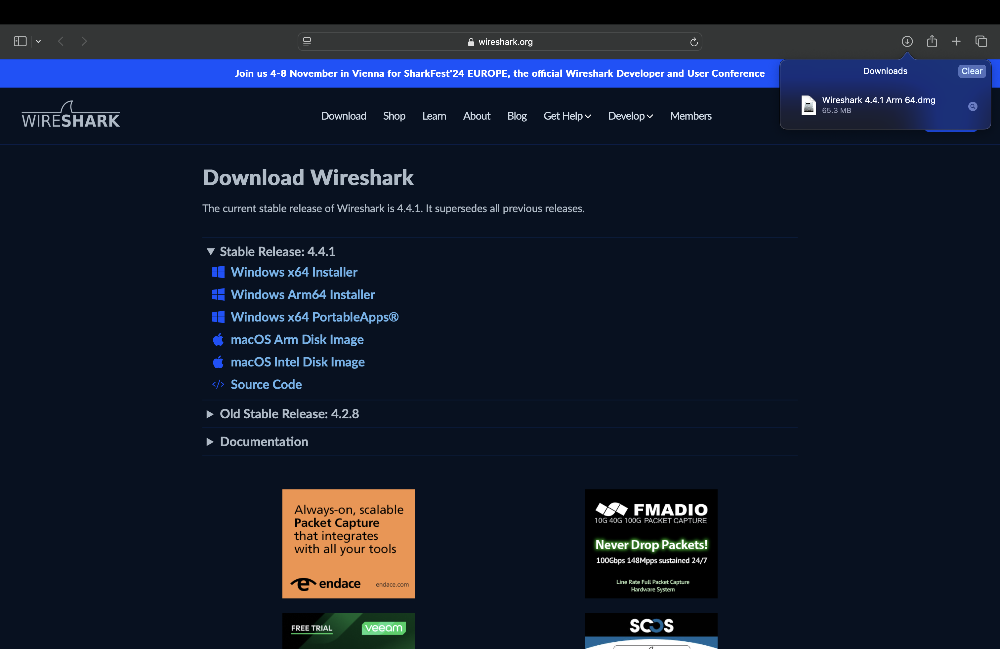
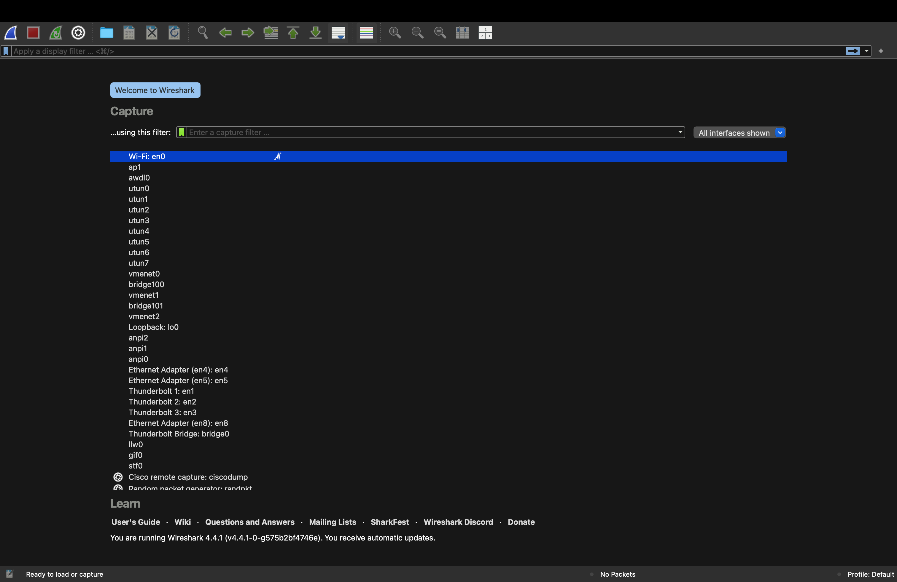

# Network Analysis Lab

**By Christopher Razo**

---

## Steps and Explanations

### **Step 1. Downloading Wireshark**
**Explanation**: Screenshot showing the official Wireshark download page for macOS, highlighting the download button. This establishes the source and legitimacy of the software used in the project.

**Screenshot**:  

---

### **Step 2. Installing Wireshark**
**Explanation**: Screenshot of the Wireshark installer window with the drag-and-drop installation process, documenting how Wireshark was added to the Applications folder on the MacBook Pro.

**Screenshot**:  

---

### **Step 3. Opening Wireshark for the First Time**
**Explanation**: Screenshot showing the initial Wireshark interface upon launching, capturing any security prompts encountered and confirming that the application is ready for use.

**Screenshot**:  

---

## Navigation

[⬅️ Back to Projects](../index.md#projects)  
[🔝 Back to Top](#network-analysis-lab)
