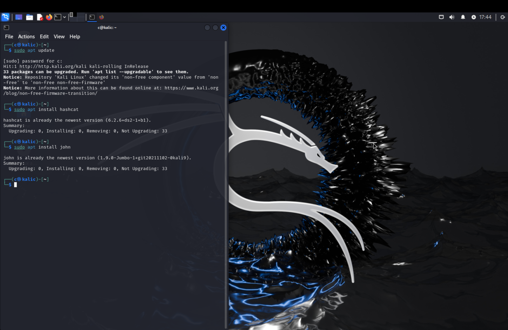
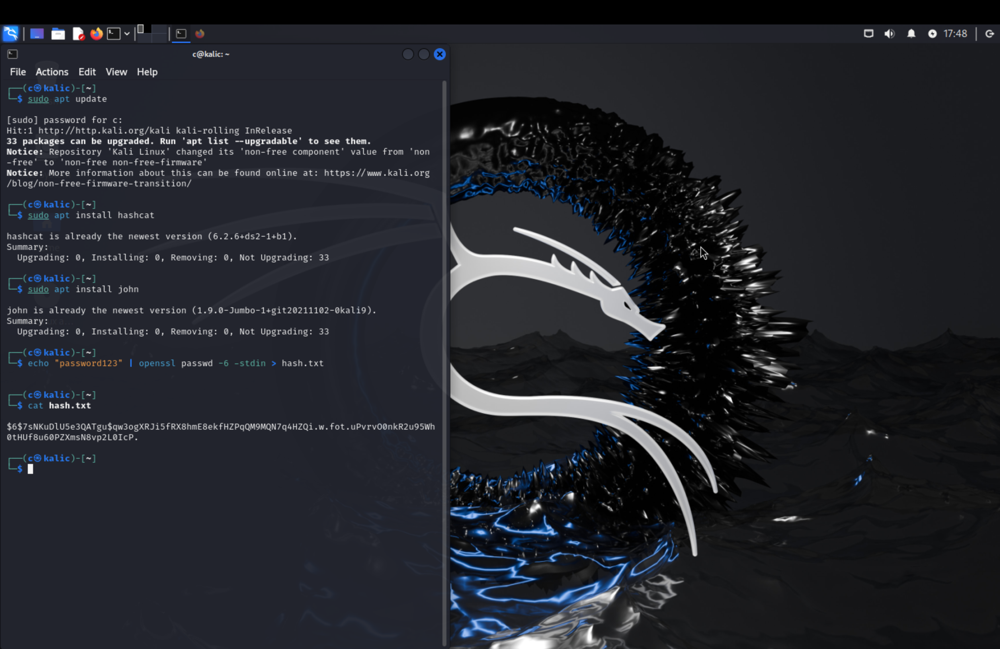
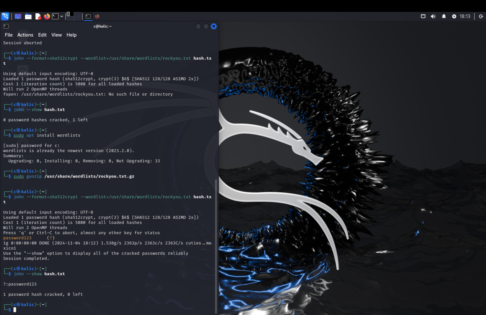
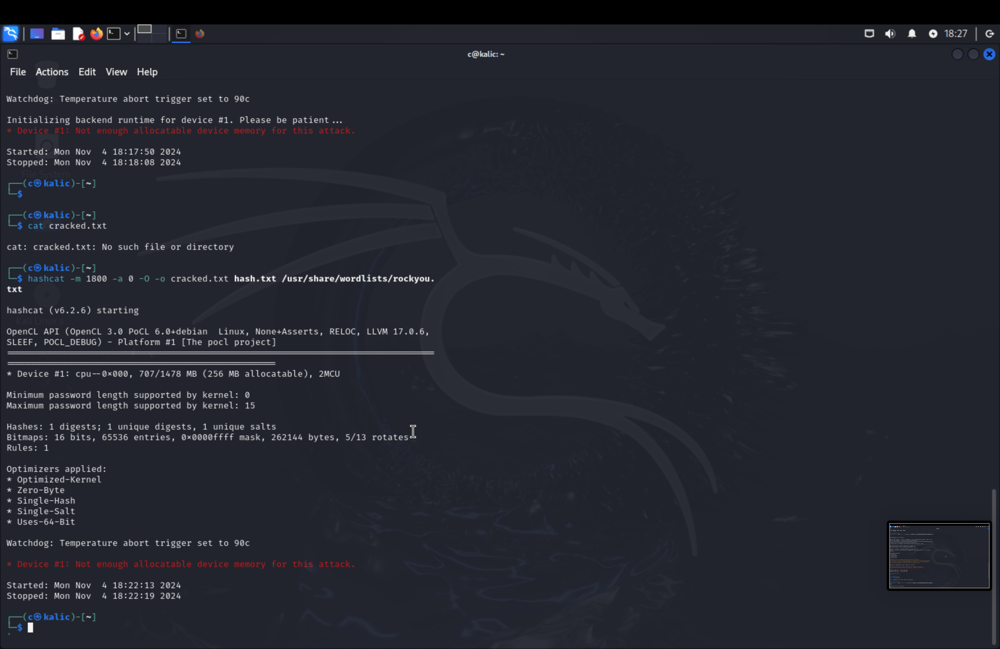

# Password Cracking Lab: Enhancing Security Through Ethical Hacking

**By Chris Razo**

---

# Password Cracking & Encryption - Project Overview

In this project, I explored password cracking and encryption techniques using tools like John the Ripper and Hashcat. This involved creating and cracking a sample hashed password, understanding system resource limitations, and learning about effective password security.

The **Password Cracking Lab** explores ethical hacking techniques to analyze and strengthen password security. Using tools such as Hashcat and John the Ripper, this lab focuses on understanding password vulnerabilities and implementing robust security measures.

This project aims to educate learners on how attackers exploit weak passwords and how to mitigate these risks.

---

## Features

- **Hash Analysis**: Learn to identify and analyze different types of password hashes.
- **Cracking Techniques**: Practice cracking weak passwords using brute force, dictionary, and hybrid attacks.
- **Tool Utilization**: Gain hands-on experience with tools like Hashcat and John the Ripper.
- **Best Practices**: Develop strategies for creating secure passwords.

---

## Objectives

- Understand how attackers exploit password vulnerabilities.
- Learn to evaluate the strength of passwords using ethical hacking tools.
- Implement best practices for secure password creation and management.

---

## Step 1: Environment Setup

I set up my Kali Linux Debian VM on VMware Fusion, allocating 2 processor cores and 20 GB of storage. Below is a screenshot of the setup environment.

---

## Step 2: Installing John the Ripper and Hashcat

After setting up the environment, I installed John the Ripper and Hashcat. Here’s the command and installation confirmation:

---

## Step 3: Creating a Sample Password Hash

I generated a hashed password and stored it in a file named `hash.txt`. This hash was created with SHA-512, providing a strong encryption method.

---

## Step 4: Cracking the Password with John the Ripper

I used John the Ripper to crack the password hash. Here is the successful result showing the cracked password:

---

## Project Outcome and Learnings

This project demonstrated the importance of strong passwords and the effectiveness of various password-cracking tools. I also encountered resource limitations in my VM, which helped me understand the importance of hardware in security testing.

---

## Navigation
[⬅️ Back to Labs](https://c-razo.github.io/portfolio-v2)

[⬆️ Back to Top](#password-cracking-lab-enhancing-security-through-ethical-hacking)

