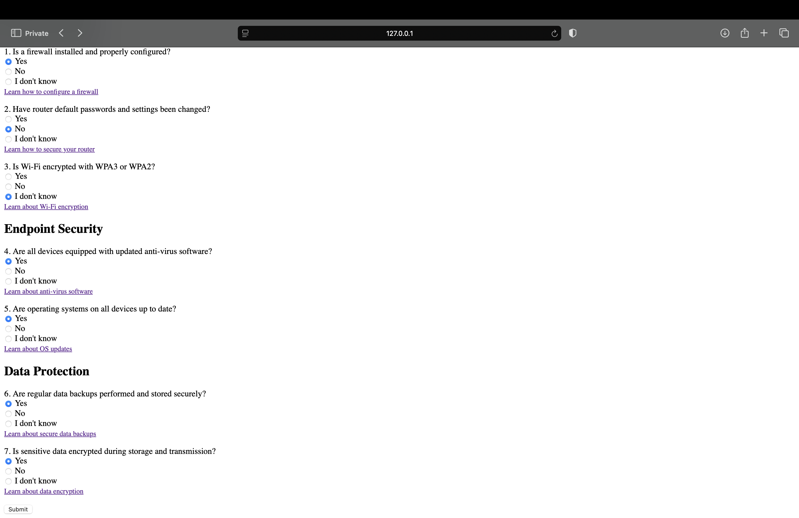

# Cybersecurity Checklist Tool

**By Chris Razo**

---

## Overview

The **Cybersecurity Checklist Tool** is an easy-to-use web application designed to help small businesses assess and improve their cybersecurity posture. It provides actionable recommendations, helping users secure their networks, endpoints, and sensitive data.

---

## Features

- **Customizable Checklist**: Tailored for small businesses to evaluate network, endpoint, and data security.
- **Actionable Recommendations**: Links to guides for implementing best practices.
- **Real-time Scoring**: Offers immediate feedback and improvement suggestions.
- **Educational Resources**: Expanding resources linked to checklist items for deeper learning.

---

## Objectives

- Simplify cybersecurity for small businesses.
- Highlight critical vulnerabilities and how to fix them.
- Provide a scalable tool for ongoing security assessment.
- Raise awareness of security best practices.

---

## Current Progress

- ✅ Developed a comprehensive checklist covering key security areas.
- ✅ Implemented real-time result scoring with actionable advice.
- 🟡 Exploring integration with external resources for automatic checks.
- 🟡 Expanding educational resources linked to each checklist item.

---

## Visual Demonstrations

### **1. Starting the Application**
  
*The terminal output shows the successful initiation of the application, running locally with Flask.*

### **2. Welcome Page**
  
*The welcome page greets users with a call-to-action to begin the assessment.*

### **3. Cybersecurity Checklist (Network Security Section)**
  
*The Network Security section evaluates firewalls, router security, and Wi-Fi encryption.*

### **4. Cybersecurity Checklist (Endpoint and Data Security Sections)**
  
*Additional sections cover antivirus software, OS updates, and data protection practices.*

### **5. Results Page**
  
*The result page provides a security score and improvement recommendations.*

### **6. Terminal Logs**
  
*The terminal logs user interactions, showcasing backend functionality.*

---

## GitHub Repository
[Explore the Repository on GitHub](https://github.com/c-razo/cybersecurity-checklist-tool)

---

## Navigation
[⬅️ Back to Projects](../index.md#projects)  
[⬆️ Back to Top](#cybersecurity-checklist-tool)
