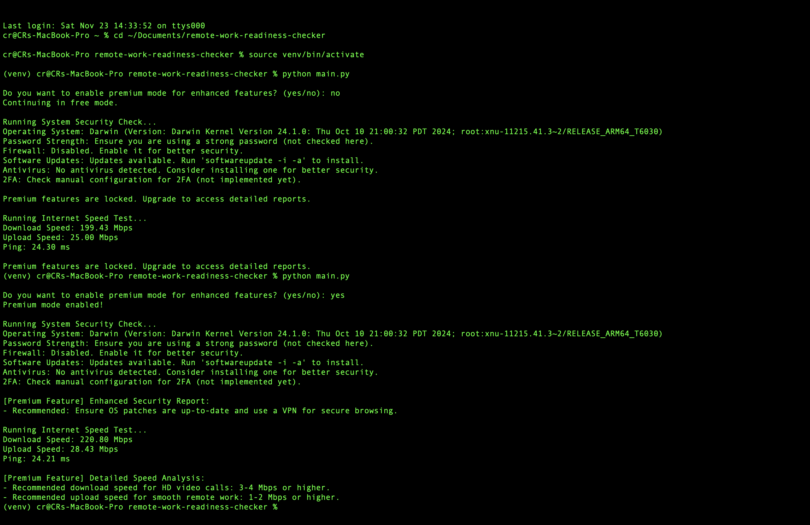

# Remote Work Readiness Checker

**By Christopher Razo**

---

## Overview

The **Remote Work Readiness Checker** is a comprehensive tool designed to assess the security and performance of a remote work environment. It helps users identify vulnerabilities in their networks, devices, and setups, providing actionable recommendations to optimize their workspace for security and efficiency.

This tool ensures that remote workers can achieve a seamless and secure work experience, addressing the growing challenges of hybrid and remote work.

---

## Features

- **Network Diagnostics**: Identifies issues with internet speed, latency, and connectivity.
- **Security Recommendations**: Offers actionable advice for securing home networks.
- **Checklist Integration**: Evaluates hardware and software readiness.
- **Customizable Reports**: Generates detailed reports for users to review and improve their setup.

---

## Objectives

- Improve the security of remote work environments.
- Help users identify potential vulnerabilities in their network and devices.
- Provide easy-to-follow recommendations for non-technical users.
- Bridge the gap between technical cybersecurity requirements and user-friendly tools.

---

## Visual Demonstration

  
*This single image illustrates the complete workflow of the Remote Work Readiness Checker, showcasing terminal output and key results.*

---

## GitHub Repository

[Explore the Repository on GitHub](https://github.com/c-razo/remote-work-readiness-checker)

---

[⬅️ Back to Projects](../index.md)  
[🔝 Back to Top](#remote-work-readiness-checker)
