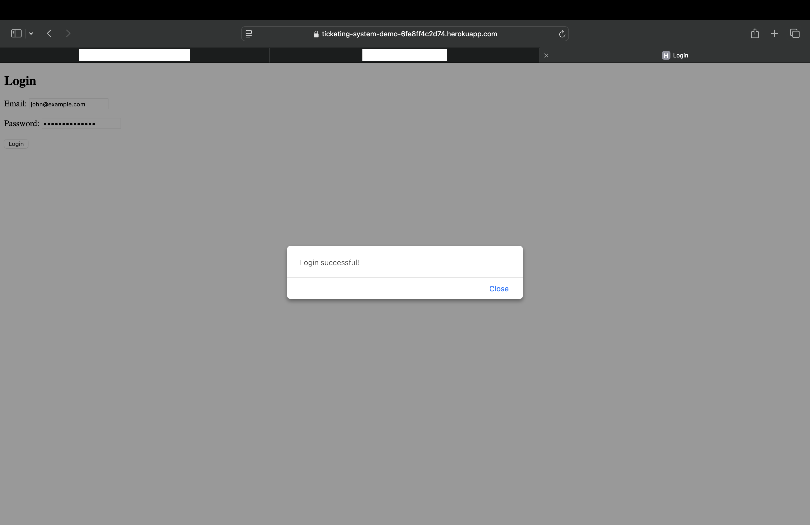

# Ticketing System Project

**By Chris Razo**

---

## Overview

The **Ticketing System Project** is a fully functional ticketing system built with Flask and SQLite, featuring user authentication using JWT (JSON Web Tokens). It allows users to register, log in, submit support tickets, and view the status of their tickets. Designed with security and usability in mind, the system simplifies managing support requests. It was designed for small businesses and teams needing an intuitive way to manage support requests.

---

## Features

- **User Registration**: Allows new users to create an account.
- **User Login**: Provides secure authentication using email and password.
- **Ticket Submission**: Enables authenticated users to submit support tickets.
- **Ticket Viewing**: Displays a list of tickets and their statuses.
- **Ticket Resolution**: Allows agents to mark tickets as resolved.

---

## Technologies Used

- **Backend**: Python, Flask
- **Database**: SQLite
- **Authentication**: JWT (JSON Web Tokens)
- **Frontend**: HTML, CSS (via Flask templates)

---

## Installation Instructions

1. **Clone the repository:**
    ```bash
    git clone https://github.com/c-razo/ticketing-system.git
    cd ticketing-system
    ```
2. **Set up a virtual environment:**
    ```bash
    python3 -m venv venv
    source venv/bin/activate  # On macOS/Linux
    venv\Scripts\activate     # On Windows
    ```
3. **Install dependencies:**
    ```bash
    pip install -r requirements.txt
    ```
4. **Run the application:**
    ```bash
    python backend/app.py
    ```
5. **Navigate to** `http://127.0.0.1:5000` in your browser to access the app.

---

## Current Progress

- ✅ User registration and login using JWT authentication.
- ✅ Ticket submission and viewing functionality.
- ✅ Secure database integration with SQLite.
- 🟡 Enhancing the UI for better user experience.
- 🟡 Adding email notifications for ticket updates.

---

## Visual Demonstrations

### **1. Login Page**  
  
*The login page provides secure access to the ticketing system.*

### **2. Tickets Page**  
  
*The tickets page lists allows one to submit the request.*

### **3. Ticket Submitted Successfully**  
  
*The tickets page confirms the ticket was submitted.*


Disclaimer: The Heroku demo may take a few seconds to load as it is hosted on a free-tier dyno.

---

## Challenges

- Implementing JWT authentication securely.
- Handling user sessions in a stateless environment.
- Managing and tracking ticket statuses efficiently.

---

## Future Improvements

- Add email notifications for ticket updates.
- Integrate with an external ticketing platform for advanced features.
- Develop an admin panel for agents to manage tickets more effectively.

---

## GitHub Repository

[Explore the Repository on GitHub](https://github.com/c-razo/ticketing-system)

---

## Navigation

[⬅️ Back to Projects](../index.md#projects)

[⬆️ Back to Top](#ticketing-system-project)

